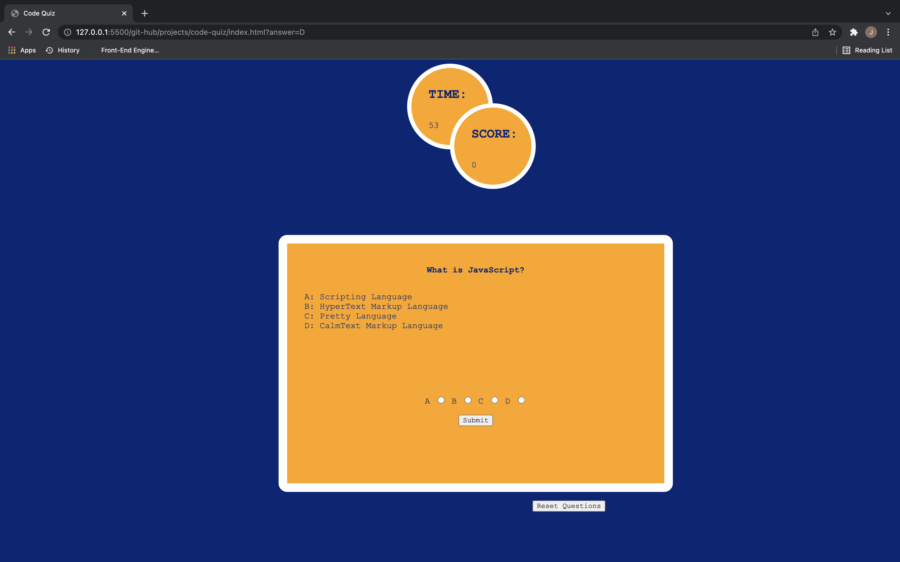

# code-quiz

---

## Preview

---

## Description

This is a timed coding quiz with multiple-choice questions that runs in the browser using JavaScript.

---

## Developers

James J. Gault

---

## Technologies

1. HTML
2. CSS
3. JavaScript

---

## Foresight

What features do you hope to implement in the future?

This page can be used as a quick refresher on web programming information at random.

---

## Incentive

What was your motivation?

Mimicing coding assessment that someone may be asked to complete to show compentency in web development.

---

## Challenges

What challenges did you face?
Challengesfaced consisted of compiling the logic behind potential errors that could be caused by the user.

---

## Reasoning

This project was built to show how JavaScript can be used to control the flow of user input.

---

## Solution

This coding quiz could potentially assist someone who doesnt know a few of the basic skills of JavaScript to learn a few helpful things.

---

## Take away

The key point of this webpage is that JavaScript is a dynamic powerful language that is wildly used for just that reason.

---